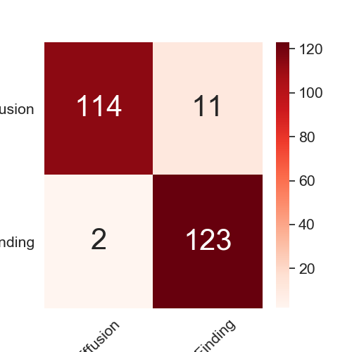
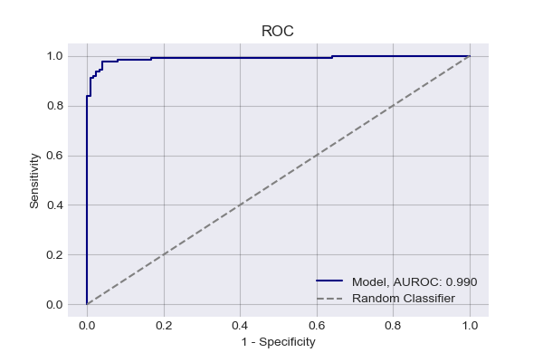

# PLEURAL EFFUSION CLASSIFICATION BASED ON CHEST X-RAY IMAGES USING CONVOLUTIONAL NEURAL NETWORK

This repo contains the source code of my undergraduate thesis project. The goal of this project is to create a machine learning model that not only able to classify a chest x-ray image but also able to detect an abnormal lung condition called Pleural Effusion based on that image.

This model has been trained with numbers of chest x-ray images of pleural effusion class from the famous ChestXray14 dataset to detect the presence of effusion. The chest x-ray image was chosen to be the media for detecting because it's a common practice for the radiologist to detect abnormalities in the lungs such as pleural effusion based on a chest x-ray.

We're using modified VGG19 architecture for our base model and trained it on the dataset, and for localization of the effusion, we used the grad-cam technique.

The result is intriguing, as the model can classify the test dataset with 95% accuracy and decent results of other metrics.

Confusion matrix and ROC of the test predictions

 

Furthermore, the model was also able to detect the area the most indicative of pleural effusion with high confidence.

Samples of heatmap produced by the model

The full paper can be seen [here](https://)
