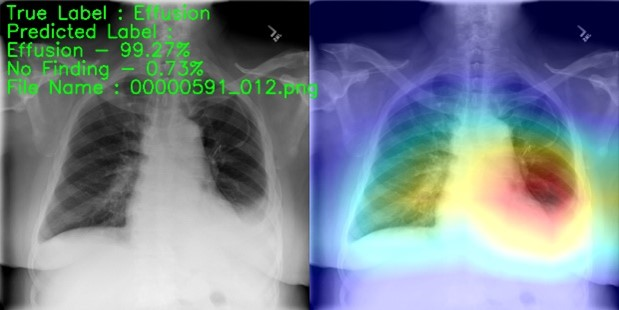
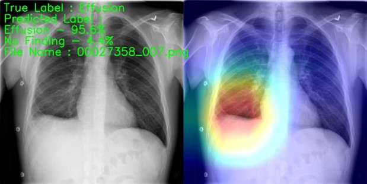

# Pleural Effusion Classification Based on Chest X-Ray Images using Convolutional Neural Network

This repo contains the source code of my undergraduate thesis project. 
The goal of this project is to create a model to classify chest x-ray images and detect an abnormal lung condition called Pleural Effusion.

The model used is pre-trained VGG19 that has been trained with numbers of chest x-ray images of pleural effusion class from the ChestXray14 dataset,
and for localization purposes, the grad-cam technique is used.

Samples of heatmap produced by the model

The paper can be found [here](https://jiki.cs.ui.ac.id/index.php/jiki/article/view/898/437)
